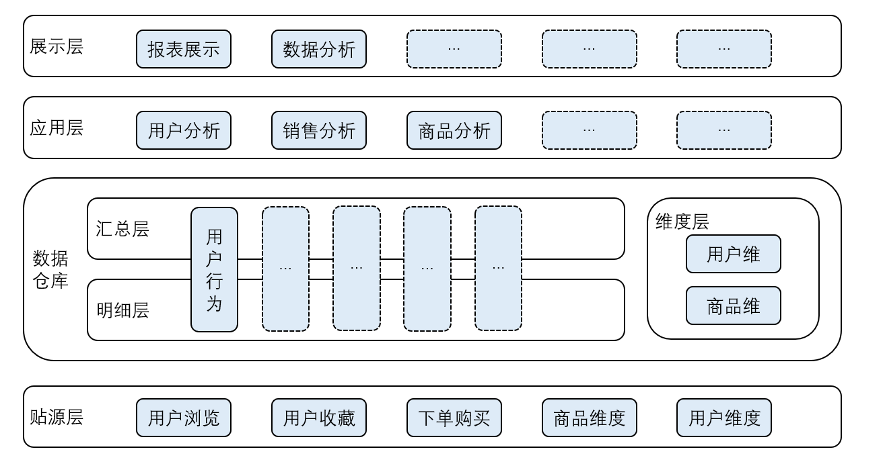

# 关于此仓库

此仓库是使用互联网上公开的数据集，模拟业务需求，以大数据处理技术为核心，展示大数据时代，对海量数据的全生命周期处理方式。

目前（2022/5/3）已经完成了离线数仓部分，使用经典的MySQL+SQOOP+Hive+Spark SQL架构；接下来会持续完成实时数仓（MySQL+Flink CDC+Kafka+Flink）和数据湖流批一体（MySQL+Flink CDC+Hudi+Flink）。欢迎Watch、Star、issue。

## 数据来源与数据说明

### 数据来源

数据来源阿里云天池，由飞猪提供。该数据集是用户脱敏行为数据，包括基本属性用户和商品基本属性的脱敏信息。

数据链接：https://tianchi.aliyun.com/dataset/dataDetail?dataId=113649

### 数据说明

数据包含三部分，分别为用户历史行为脱敏数据、用户基础属性脱敏数据以及商品基础属性脱敏数据。

| 文件名称                       | 说明                       | 包含特征                                     |
| ------------------------------ | -------------------------- | -------------------------------------------- |
| user_item_behavior_history.csv | 包含所有的用户行为数据     | 用户ID，商品ID，行为类型，时间戳             |
| user_profile.csv               | 包含所有的用户基础属性画像 | 用户ID，年龄，性别、职业、常居城市、人群标签 |
| item_profile.csv               | 包含所有的商品基础属性画像 | 商品ID，商品类目ID，商品城市，商品标签       |

**user_item_behavior_history.csv**

本数据文件包含了2019年6月3日至2021年6月3日，随机抽取的约200多万用户的所有行为（行为包括点击、收藏、加购、购买），数据集的组织形式和MovieLens-20M类似，即数据集的每一行表示一条用户行为，由用户ID、商品ID、行为类型和时间戳组成，并以英文逗号分隔。关于数据集中每一列的详细描述如下：

| 列名称   | 说明                                                |
| -------- | --------------------------------------------------- |
| 用户ID   | 整数类型，序列化后的用户ID                          |
| 商品ID   | 整数类型，序列化后的商品ID                          |
| 行为类型 | 字符串，枚举类型，包括('clk', 'fav', 'cart', 'pay') |
| 时间戳   | 整数类型，行为发生的时间戳                          |

**user_profile.csv**

本数据文件主要包含了约二百万随机用户的基础属性特征，比如年龄、性别、职业、常居城市ID、人群标签等，数据集的每一行表示一条用户信息，并以英文逗号分隔。关于数据集中每一列的详细描述如下：

| 列名称   | 说明                                     |
| -------- | ---------------------------------------- |
| 用户ID   | 整数类型，序列化后的用户ID               |
| 年龄     | 整数类型，序列化后的年龄ID               |
| 性别     | 整数类型，序列化后性别ID                 |
| 职业     | 整数类型，序列化后职业ID                 |
| 常居城市 | 整数类型，序列化后城市ID                 |
| 人群标签 | 字符串，每个标签序列化后ID用英文分号分割 |

**item_profile.csv**

本数据文件主要包含了约27万商品的基础属性特征，比如商品类目ID，商品城市，商品标签等，数据集的每一行表示一条商品的信息，并以逗号分隔。关于数据集中每一列的详细描述如下：

| 列名称     | 说明说明                                 |
| ---------- | ---------------------------------------- |
| 商品ID     | 整数类型，序列化后的商品ID               |
| 商品类目ID | 整数类型，序列化后的商品类目ID           |
| 商品城市   | 整数类型，序列化后的商品城市ID           |
| 商品标签   | 字符串，每个标签序列化后ID用英文分号分割 |

关于数据集大小的一些说明如下：

| 维度           | 数量     |
| -------------- | -------- |
| 用户数量       | 5744057  |
| 商品数量       | 267326   |
| 类目数量       | 115      |
| 城市数量       | 341      |
| 用户人群标签   | 12       |
| 商品玩法标签   | 208      |
| 用商品交互数量 | 22516238 |

## 一、离线数仓

### （一）需求描述

#### 1. 报表需求

平台经过长期发展，积累了大量客户行为数据与客户维度、商品维度数据 。 为了掌握平台发展情况，故对平台数据提炼分析，获取以下报表指标：

- 活跃用户比例
- 用户性别比例
- 月增长用户数
- 业务新开展城市
- 销售数量环比

#### 2. 数据分析

平台经过长期发展，积累了大量客户行为数据与客户维度、商品维度数据 。 为了分析客户的行为，挖掘潜在需求，故对平台数据提炼分析，获取以下分析指标：

- 点击与购买转化比
- 热销商品Top10
- 活跃用户Top10
- 优质客户Top10
- 被购买商品数量最多的城市Top5

### （二）设计概述

#### 1. 总体分层设计

总体一共分为贴源层、明细层、汇总层、应用层、展示层。贴源层内是用户的各类行为数据和商品、用户维度数据，经标准化处理和维度划分后写入数仓明细层与维度层；为了分析时减少关联表，明细层与维度层关联为大宽表汇入汇总层；在汇总层内，计算报表指标和分析指标写入服务层，展示层直接从服务层内取数，做可视化展示。



#### 2. 数据流程设计

数据集是CSV文件的形式，编写Java程序读取CSV文件，写入MySQL做数据源；使用SQOOP每天导入增量数据到Hive ODS，经过Spark SQL标准处理后写入DWD；在DWD内进一步把需要分析的表关联维度表写入DWS，计算后的结果写入APP，存入MySQL；最终使用Tableau读取MySQL数据，做可视化展示。

ODS到APP使用DolphinScheduler调度所有任务，使用Yarn做统一资源调度。


#### 3. 命名设计

##### （1）表名命名设计

表名由以下组成：

**数据所属层级**：ODS、DWD、DWS等；

**主题域**：根据主题域命名，如订单、用户、商品等；

**表内涵**：表数据内容描述；

**维度/事实**：维度使用DIM表示，事实使用FACT表示；

**加载方式**：D：每天，M：月，Y：年，一次性加载不作区分；

**增/全量**：增量使用I，全量使用H。

数据所属层级、主题域、表内涵、维度/事实、加载方式之间使用下划线连接，加载方式、增/全量之间不做分割。如ods_user_behavior_fact_di，表示每天增量同步的用户行为表，ods_user_dim_dh，表示每天同步全量的用户维度表。

##### （2）程序命名设计

程序名由以下组成：

**程序作用层级**：ODS、DWD、DWS等；

**程序功能**：extract：抽取、transform：转换、load：加载 ；

**程序语言**：Java、Scala、Shell等；

**调度频率**：D：每天，M：月，Y：年；

**是否需要参数**：Y：是，N：否；

**程序编号**：三位，从001开始；

程序作用层级、程序功能、程序语言之间使用下划线连接，调度频率、是否需要参数之间不做分割。如ods_extract_shell_dy_001，表示抽取到ODS层的Shell脚本程序，每天运行一次，需要传入参数；dwd_transform_scala_dn_001，表示转换到DWD层的Scala语言程序，每天运行一次，不需要参数。

来源表、目标表、程序入参、调度说明等，需要编写到程序的注释说明中，并同步到数仓管理中。

#### 4. 维度/事实划分

事实涉及来自业务过程的度量，基本都以数量值表示。一个事实表行与粒度存在一对一关系；维度表是事实表不可或缺的组成部分。维度表包含业务过程度量事件有关的文本环境。他用来描述与"谁、什么、哪里、何时、如何、为什么"有关的事件。维度/事实划分需要结合主题域划分，主题域划分方式有四种：

- 按照所属系统划分：业务系统有几种，就划分几个主题域；
- 按照业务（功能模块/业务线）或业务过程划分。比如一个靠销售广告位置的门户网站主题域可能会有广告域，客户域等，而广告域可能就会有广告的库存，销售分析、内部投放分析等主题； 
- 按照部门划分主题域。比如公司里面的人力、财务、销售、运营等，运营域中可能会有工资支出分析、活动宣传效果分析等主题；
- 按照行业案例分析划分主题域。比如电信、金融都是最早建设数仓的行业，都有一些规范，比如IBM 公司的 BDWM 九大金融主题模型，Teradata 公司的 FS-LDM 十大金融主题模型，都是行业应用比较广泛的标准，这两个行业就可以参考构建自己的企业数据仓库模型规范。 

划分主题域后，以主题域内实体的每一个动作为一个事实，划分事实表；实体的属性或描述动作的属性划分为维度表。

本次Demo按照业务划分，分为用户行为主题，主题内分为用户行为事实表、用户维度表、商品维度表。

### （三）数据开发

#### 1. 数据落盘

数据集下载到本地后是以CSV的形式，分别是：

- user_item_behavior_history.csv：用户行为汇总表；
- item_profile.csv：商品维度表；
- user_profile.csv：用户维度表；

本次是编写了一个JDBC程序（详见[sendDataToMysql）](https://github.com/YiFlower/datawarehouse/tree/main/sendDataToMysql)，一次性将所有数据录入MySQL中，未做数据清洗、转换等操作。

#### 2. ODS层开发

ODS层的数据来源于MySQL，使用SQOOP做数据同步工具。第一次全量导入用户维度、商品维度数据，后续每天凌晨增量同步一个月用户行为数据到Hive。

#### 3. DWD层开发

ODS层的数据使用Spark  SQL做清洗和标准化等操作，分别汇入DWS和DIM层。

- 数据去重：对于所有列做去重操作；
- 空值过滤：过滤掉关键列值为空的行，如用户ID列、商品ID列、行为类型列等；
- 异常值过滤：对关键列做探源分析，过滤掉不符合常理或不具备分析价值的数据，如对年龄做最大值、最小值、四分位数查看，过滤掉小于16岁或大于85岁的数据；
- 码值转换：对于一些缩写或者码值表示的数据，转换为字面意义，如把性别从数字转换为男、女，把行为转换为汉字描述，减少后续分析工作；
- 关联性验证：对事实表和维度表之间的关联键做有效性验证。

清洗完成后，事实表的数据汇入DWD，维度数据汇入DIM。

#### 4. DWS层开发

DWS层是范式建模，将DWD的数据和DIM的数据关联汇总，写入DWS。

#### 5. APP层开发

APP层是DWS和展示层之间的缓冲层，用于存储计算后的指标，展示层直接从APP层取数。

本次计算的指标如下：

- [x] 月增长用户数
- [x] 平台用户年龄段
- [x] 当月业务新开展城市
- [x] 当月平台每日交易量环比

- [x] 当月交易总量趋势图
- [x] 当月点击&购买转化比
- [x] 当月活跃用户Top10
- [x] 当月优质客户Top10
- [x] 当月商品热度Top10
- [x] 各年龄段最喜爱的商品
- [x] 不同性别最喜欢的商品

#### 6. 展示层开发

展示层使用Tableau可视化工具，对APP层计算完成的指标进行绘图。

- [x] 月增长用户数


- [x] 平台用户年龄段


- [x] 当月业务新开展城市


- [x] 当月平台每日交易量环比


- [x] 当月交易总量趋势图


- [x] 当月点击&购买转化比


- [x] 当月活跃用户Top10


- [x] 当月优质客户Top10


- [x] 当月商品热度Top10


- [x] 各年龄段最喜爱的商品


- [x] 不同性别最喜欢的商品


#### 7. 调度开发

目前开发的任务一共有四个：SQOOP导入MySQL到ODS、ODS清洗数据写入DWD、DWD聚合为宽表写入DWS、DWS计算指标写入APP， 每一个任务的输入都依赖于上一个任务的输出，将四个任务串成一个工作流，每个任务都配置失败重试次数，达到最大重试次数仍运行失败则停止整个工作流。

### （四）数仓管理

#### 1. 元数据管理

数仓中的元数据，主要记录各主题的定义、不同层级间的映射关系、监控数据仓库的数据状态及 ETL 的任务运行状态。一般会通过元数据资料库来统一地存储和管理元数据，其主要目的是使数据仓库的设计、部署、操作和管理能达成协同和一致。 可将其按用途的不同分为两类：技术元数据（Technical）和业务元数据（Business）。

技术元数据是存储关于数据仓库系统技术细节的数据，是用于开发和管理数据仓库使用的数据；业务元数据主要描述“数据”背后的业务含义，从业务角度描述业务领域的相关概念、关系。

在小企业或数仓建设初期，确定源系统和元数据构成后，先将源系统的元数据整理并记录，可以用文档记录；也可以存入关系型数据库中。随着数据仓库系统的建设，逐步将需要的元数据补充录入；数据仓库建设完成后，对元数据进行结构化、标准化储存。

#### 2. 数仓权限管理

数仓权限管理可以分为三类：

1. Hadoop、Hive本身的权限控制：如同Linux的文件系统类似，HDFS也有与之对应的权限管控，如用户、用户组、读写执行权限等；
2. Kerberos安全认证：解决权限认证的问题，但是存在授权弊端，需要集成授权组件使用；
3. Apache Ranger权限管理方案：用来提供授权策略的管理服务，可以通过Web UI对用户、角色、组、授权策略进行变更，这些管理能力也会通过REST API对外暴露。

## 二、实时数仓

### （一）数据流程设计

数据集是CSV文件的形式，编写Java程序读取CSV文件，流式写入Kafka模拟业务数据库入ODS；使用Flink标准处理后写入DWD；在DWD内进一步把需要分析的表关联维度表写入DWS，计算后的结果落到APP层，存入MySQL；最终使用SpringBoot + MyBatis读取MySQL数据做后端，HTML + JQuery做前端看板页面。

整体DolphinScheduler调度所有任务，使用Yarn做统一资源调度。


### （二）启动流程

一共有3个model，分别是streamData，用于发送数据到Kafka；realtime是实时计算，计算结果落地到MySQL；realtimeApp是将计算的结果展示到Web上。需要分别打包三个项目到服务器运行，服务器需要有MySQL服务、Flink、Kafka等服务。操作步骤如下说明。

#### 1. 启动Flink Session

由于任务较多，所以采用FlinkSession的方式运行小任务；对于较大的任务，则采用Flink On Yarn App模式。启动Session会返回一个URL地址，其中host:port是用于提交Flink任务时需要指定的会话标识。

```
yarn-session.sh  -nm flink-session-001 -jm 2048 -d 
# JobManager Web Interface: http://cdh03:34429
```


#### 2. Kafka新建数仓话题

```
# delete
kafka-topics --delete --topic example-dw-ods --zookeeper cdh01:2181,cdh02:2181,cdh03:2181
kafka-topics --delete --topic example-dw-dwd --zookeeper cdh01:2181,cdh02:2181,cdh03:2181
kafka-topics --delete --topic example-dw-dws --zookeeper cdh01:2181,cdh02:2181,cdh03:2181

# create
kafka-topics --create --partitions 10 --replication-factor 1 \
--topic example-dw-ods \
--zookeeper cdh01:2181,cdh02:2181,cdh03:2181

kafka-topics --create --partitions 10 --replication-factor 1 \
--topic example-dw-dwd \
--zookeeper cdh01:2181,cdh02:2181,cdh03:2181

kafka-topics --create --partitions 10 --replication-factor 1 \
--topic example-dw-dws \
--zookeeper cdh01:2181,cdh02:2181,cdh03:2181

# list
kafka-topics --list --zookeeper cdh01:2181,cdh02:2181,cdh03:2181
```


#### 3. 创建MySQL落地表

```
-- DELETE
DROP TABLE IF NOT EXISTS new_user_count;
DROP TABLE IF NOT EXISTS total_sales;
DROP TABLE IF NOT EXISTS hot_city;
DROP TABLE IF NOT EXISTS active_user_count;

-- CREATE
CREATE TABLE IF NOT EXISTS new_user_count (
`dt` VARCHAR(15),
`add_user` VARCHAR(20),
PRIMARY KEY(dt)
);

CREATE TABLE IF NOT EXISTS total_sales (
`dt` VARCHAR(15),
`total` VARCHAR(20),
PRIMARY KEY(dt)
);

CREATE TABLE IF NOT EXISTS hot_city (
`dt` VARCHAR(15),
`city` VARCHAR(20),
PRIMARY KEY(dt)
);

CREATE TABLE IF NOT EXISTS active_user_count (
`dt` VARCHAR(15),
`user_name` VARCHAR(20),
PRIMARY KEY(dt)
);
```


#### 4. 启动业务大屏Web

```
java -jar ./realtimeApp-0.0.1-SNAPSHOT.jar
```


#### 5. 启动Flink任务

```
# DWS -> APP
flink run -m cdh03:34429 -c com.bw.calc.app.AppCalcNewUserCount  ./FlinkModule-1.0-SNAPSHOT.jar
flink run -m cdh03:34429 -c com.bw.calc.app.AppCalcSalesCount  ./FlinkModule-1.0-SNAPSHOT.jar
flink run -m cdh03:34429 -c com.bw.calc.app.AppCalcHotCity  ./FlinkModule-1.0-SNAPSHOT.jar
flink run -m cdh03:34429 -c com.bw.calc.app.AppCalcActiveUser  ./FlinkModule-1.0-SNAPSHOT.jar
# ODS -> DWD
flink run -m cdh03:34429 -c com.bw.calc.dw.OdsCalc  ./FlinkModule-1.0-SNAPSHOT.jar

# DWD -> DWS，任务较大，单独启动
flink run-application -t yarn-application ./FlinkModule-1.0-SNAPSHOT.jar
```


#### 6.启动数据发送服务

启动此任务后，数据将流式的发送到Kafka ODS；每发送1000条，sleep（0，1）秒。

```
java -jar streamData-1.0-SNAPSHOT-jar-with-dependencies.jar 
```

---

至此，整个流程即启动完毕。启动完成后，如果有开启Kafka消费端，将能实时监控到整个程序运行过程中的数据流动。


### （三）运行效果

运行前，实时看板的四个指标都为0。


待项目完整启动后，指标将根据实时计算的结果展示（基于每秒一次请求接口的结果变化）。


GIF：


## 三、数据湖与流批一体

</>


